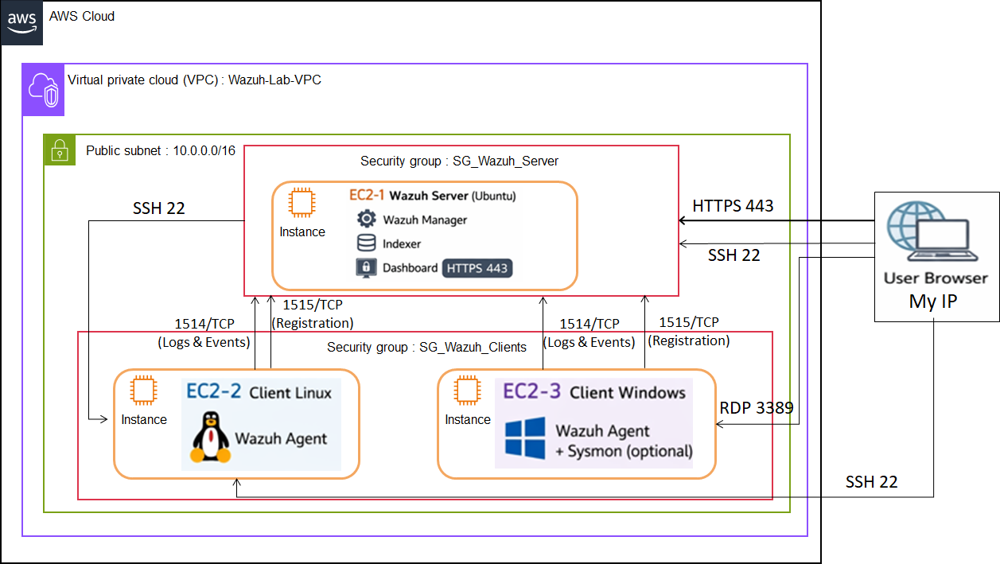

# Atelier_Sécurité des endpoints et supervision SIEM  
## Étude de cas multi-OS (Linux & Windows)

[](https://aws.amazon.com/)
[](https://wazuh.com/)
[](https://ubuntu.com/)
[](https://www.microsoft.com/)

---

## 📌 Présentation du projet

Ce projet a été réalisé dans le cadre du module **Virtualisation et Cloud Computing**.  

Il consiste à mettre en place une **plateforme complète de supervision de la sécurité** basée sur **Wazuh**, combinant les approches **SIEM** (Security Information and Event Management) et **EDR** (Endpoint Detection and Response), déployée sur **AWS Learner Lab**.

L'objectif est de collecter, centraliser et analyser les événements de sécurité générés par des **endpoints Linux et Windows**, afin d'illustrer le fonctionnement d'un **SOC (Security Operations Center) moderne**.

---

## 🎯 Objectifs pédagogiques

- ✅ Déployer une infrastructure Cloud sécurisée sur AWS (VPC, Security Groups, EC2)
- ✅ Installer et configurer un serveur Wazuh All-in-One
- ✅ Enrôler des agents Wazuh sur Linux et Windows
- ✅ Générer et détecter des événements de sécurité en temps réel
- ✅ Analyser les alertes via le dashboard SIEM
- ✅ Comprendre les concepts de **SIEM, EDR, IAM/PAM et Threat Hunting**

---

## 🧰 Technologies et outils utilisés

| Technologie | Version | Rôle |
|------------|---------|------|
| **AWS EC2** | Cloud | Hébergement des instances |
| **VPC & Security Groups** | AWS | Isolation et sécurité réseau |
| **Ubuntu Server** | 22.04 LTS | Serveur Wazuh + Client Linux |
| **Windows Server** | 2022 / Windows 10-11 | Client Windows |
| **Wazuh** | 4.7 | SIEM + EDR |
| **Sysmon** (optionnel) | Latest | Enrichissement EDR Windows |
| **SSH** | - | Administration Linux |
| **RDP** | - | Administration Windows |

---

## 🏗️ Architecture du lab

### 🔹 Vue d'ensemble

L'architecture repose sur :
- **1 VPC dédié** (`10.0.0.0/16`)
- **1 subnet public** (`10.0.0.0/24`) et **1 subnet privé** (`10.0.1.0/24`)
- **3 instances EC2** dans le même réseau
- **2 Security Groups** configurés de manière stricte



### 🔹 Composants

| Instance | Système | Type | Rôle | Stockage |
|----------|---------|------|------|----------|
| **EC2-1** | Ubuntu 22.04 | t3.large | Wazuh All-in-One (Manager + Indexer + Dashboard) | 30 GB |
| **EC2-2** | Ubuntu 22.04 | t3.micro | Client Linux avec agent Wazuh | 8 GB |
| **EC2-3** | Windows Server 2022 | t2.medium | Client Windows avec agent Wazuh (+ Sysmon) | 30 GB |

### 🔹 Flux réseau et communications

| Source | Destination | Port | Protocole | Description |
|--------|-------------|------|-----------|-------------|
| Agents (Linux/Windows) | Wazuh Server | **1514** | TCP | Envoi des événements de sécurité |
| Agents (Linux/Windows) | Wazuh Server | **1515** | TCP | Enrôlement automatique des agents |
| Navigateur utilisateur | Wazuh Dashboard | **443** | HTTPS | Accès à l'interface web SIEM |
| Admin | Wazuh Server | **22** | SSH | Administration du serveur |
| Admin | Client Linux | **22** | SSH | Administration du client Linux |
| Admin | Client Windows | **3389** | RDP | Administration du client Windows |

---

## 🔐 Configuration des Security Groups

### 📍 **SG-Wazuh-Server**

**Règles Inbound :**

| Type | Port | Source | Description |
|------|------|--------|-------------|
| SSH | 22 | My IP | Accès administrateur |
| HTTPS | 443 | My IP | Accès dashboard Wazuh |
| TCP personnalisé | 1514 | SG-Wazuh-Clients | Réception événements agents |
| TCP personnalisé | 1515 | SG-Wazuh-Clients | Enrôlement des agents |

### 📍 **SG-Wazuh-Clients**

**Règles Inbound :**

| Type | Port | Source | Description |
|------|------|--------|-------------|
| SSH | 22 | My IP | Administration client Linux |
| RDP | 3389 | My IP | Administration client Windows |

---

## 📋 Guide de déploiement étape par étape

### **Étape 1 : Connexion à AWS Learner Lab**

1. Démarrer le lab en cliquant sur **Start Lab**
2. Attendre que l'indicateur devienne **vert**
3. Cliquer sur **AWS** pour accéder à la console

---

### **Étape 2 : Création du VPC**

1. Rechercher **VPC** dans la barre de recherche
2. Cliquer sur **Créer un VPC**
3. Choisir **VPC et plus encore**
4. Configuration :
   - **Nom** : `VPC-Wazuh-Lab`
   - **Bloc CIDR IPv4** : `10.0.0.0/16`
   - **Zones de disponibilité** : 1
   - **Sous-réseaux publics** : 1 (`10.0.0.0/24`)
   - **Sous-réseaux privés** : 1 (`10.0.1.0/24`)
   - **Passerelle NAT** : Zonal
   - **Points de terminaison VPC** : Aucun
   - **Options DNS** : Activer résolution DNS + noms d'hôtes DNS

---

### **Étape 3 : Création des Security Groups**

#### 🔸 **SG-Wazuh-Server**

Configuration détaillée dans la section [Configuration des Security Groups](#-configuration-des-security-groups)

#### 🔸 **SG-Wazuh-Clients**

Configuration détaillée dans la section [Configuration des Security Groups](#-configuration-des-security-groups)

---

### **Étape 4 : Déploiement des instances EC2**

#### 🖥️ **Instance 1 : Wazuh Server (Ubuntu)**

1. **Nom** : `Wazuh_Server`
2. **AMI** : Ubuntu Server 22.04 LTS
3. **Type d'instance** : `t3.large`
4. **Paire de clés** : Créer `KEY_Wazuh_Server.pem`
5. **VPC** : `VPC-Wazuh-Lab`
6. **Security Group** : `SG-Wazuh-Server`
7. **Stockage** : 30 GB

#### 🐧 **Instance 2 : Client Linux**

1. **Nom** : `Wazuh_Linux2_Client`
2. **AMI** : Ubuntu Server 22.04 LTS
3. **Type d'instance** : `t3.micro`
4. **Paire de clés** : Créer `KEY_Wazuh_Linux2_Client.pem`
5. **VPC** : `VPC-Wazuh-Lab`
6. **Security Group** : `SG-Wazuh-Clients`
7. **Stockage** : 8 GB

#### 🪟 **Instance 3 : Client Windows**

1. **Nom** : `Wazuh_Windows2_Client`
2. **AMI** : Windows Server 2022
3. **Type d'instance** : `t2.medium`
4. **Paire de clés** : Créer `KEY_Wazuh_Windows2_Client.pem`
5. **VPC** : `VPC-Wazuh-Lab`
6. **Security Group** : `SG-Wazuh-Clients`
7. **Stockage** : 30 GB

---

### **Étape 5 : Installation du serveur Wazuh**

#### 📡 Connexion SSH au serveur
```bash
ssh -i KEY_Wazuh_Server.pem ubuntu@<IP_PUBLIQUE_WAZUH_SERVER>
```

#### 🚀 Installation All-in-One
```bash
# Mise à jour du système
sudo apt update && sudo apt -y upgrade

# Téléchargement du script d'installation
curl -sO https://packages.wazuh.com/4.7/wazuh-install.sh

# Installation automatique (Manager + Indexer + Dashboard)
sudo bash wazuh-install.sh -a
```

> ⚠️ **Important** : Le script affiche à la fin :
> - URL du dashboard : `https://<IP_SERVER_WAZUH>`
> - **User** : `admin`
> - **Password** : `*ChBidg89A.Qwr8LhZw+2t?vJyhoJPHG` *(exemple)*

**💾 Sauvegarder ces identifiants !**

#### ✅ Vérification des services
```bash
sudo systemctl status wazuh-manager
sudo systemctl status wazuh-indexer
sudo systemctl status wazuh-dashboard
```

Tous les services doivent être **active (running)**.

---

### **Étape 6 : Accès au Wazuh Dashboard**

1. Ouvrir un navigateur web
2. Accéder à : `https://<IP_PUBLIQUE_WAZUH_SERVER>`
3. Accepter le certificat auto-signé (**Paramètres avancés > Continuer**)
4. Se connecter avec :
   - **User** : `admin`
   - **Password** : *(récupéré lors de l'installation)*

À ce stade, **aucun agent n'est encore enrôlé**.

---

### **Étape 7 : Enrôlement du client Linux**

#### 📌 Depuis le Dashboard Wazuh

1. Cliquer sur **Add agent** ou **Wazuh > Agents**
2. Sélectionner **Linux**
3. **Adresse du serveur** : IP privée du serveur Wazuh (`10.0.0.X`)
4. **Nom de l'agent** : `Client-Linux`
5. Copier les commandes générées

#### 🐧 Sur le client Linux
```bash
# Connexion SSH
ssh -i KEY_Wazuh_Linux2_Client.pem ubuntu@<IP_PUBLIQUE_CLIENT_LINUX>

# Installation de l'agent (exemple de commande générée)
wget https://packages.wazuh.com/4.x/apt/pool/main/w/wazuh-agent/wazuh-agent_4.7.0-1_amd64.deb
sudo WAZUH_MANAGER='<IP_PRIVEE_SERVEUR_WAZUH>' dpkg -i ./wazuh-agent_4.7.0-1_amd64.deb

# Démarrage de l'agent
sudo systemctl daemon-reload
sudo systemctl enable wazuh-agent
sudo systemctl start wazuh-agent
```

#### ✅ Vérification

L'agent apparaît comme **Active** dans le dashboard.

---

### **Étape 8 : Enrôlement du client Windows**

#### 🔑 Récupération du mot de passe Windows

1. Dans AWS Console > EC2 > Instances
2. Sélectionner l'instance Windows
3. **Actions > Sécurité > Obtenir le mot de passe Windows**
4. Charger la clé `KEY_Wazuh_Windows2_Client.pem`
5. Cliquer sur **Déchiffrer le mot de passe**

#### 🖥️ Connexion RDP

1. Appuyer sur **Windows + R**
2. Taper : `mstsc`
3. Entrer l'**IP publique** du client Windows
4. Se connecter avec les identifiants récupérés

#### 📌 Depuis le Dashboard Wazuh

1. Sélectionner **Windows**
2. **Adresse du serveur** : IP privée du serveur Wazuh
3. **Nom de l'agent** : `Client-Windows`
4. Copier les commandes PowerShell générées

#### 🪟 Sur le client Windows (PowerShell Admin)
```powershell
# Téléchargement et installation (exemple)
Invoke-WebRequest -Uri https://packages.wazuh.com/4.x/windows/wazuh-agent-4.7.0-1.msi -OutFile wazuh-agent.msi
msiexec.exe /i wazuh-agent.msi /q WAZUH_MANAGER='<IP_PRIVEE_SERVEUR_WAZUH>' WAZUH_AGENT_NAME='Client-Windows'

# Démarrage du service
NET START WazuhSvc
```

#### ✅ Vérification

L'agent apparaît comme **Active** dans le dashboard.

---

## 🎭 Scénarios de démonstration de sécurité

### 🐧 **Scénarios Linux**

#### 🔴 **Scénario 1 : Bruteforce SSH**

**Objectif** : Simuler des tentatives d'authentification SSH échouées
```bash
# Depuis une machine externe ou le serveur Wazuh
ssh fakeuser@<IP_CLIENT_LINUX>
# Répéter 5 à 10 fois avec un mauvais mot de passe
```

**Résultat attendu** : Alertes de type `authentication_failed` / `sshd`

---

#### 🟠 **Scénario 2 : Élévation de privilèges**

**Objectif** : Détecter l'utilisation de `sudo`
```bash
sudo su
```

**Résultat attendu** : Événements `sudo` remontés dans Wazuh

---

#### 🟡 **Scénario 3 : Modification fichier sensible (FIM)**

**Objectif** : Déclencher une alerte File Integrity Monitoring
```bash
echo "test" | sudo tee -a /etc/passwd
```

**Résultat attendu** : Alerte FIM (si activé sur `/etc/passwd`)

---

### 🪟 **Scénarios Windows**

#### 🔴 **Scénario 1 : Échecs de connexion (Event ID 4625)**

**Objectif** : Générer des événements d'échec de connexion

- Tenter de se connecter en RDP avec un **mauvais mot de passe** (3 à 5 fois)

**Résultat attendu** : Événements Windows Security `4625` (Failed logon)

---

#### 🟠 **Scénario 2 : Création utilisateur local**

**Objectif** : Détecter la création d'un compte et l'ajout au groupe Administrators
```powershell
# PowerShell (Admin)
net user labuser P@ssw0rd! /add
net localgroup administrators labuser /add
```

**Résultat attendu** : Événements `user created` et `group changed`

---

#### 🟡 **Scénario 3 : Enrichissement EDR avec Sysmon (optionnel)**

**Installation de Sysmon** :
```powershell
# Télécharger Sysmon
Invoke-WebRequest -Uri https://download.sysinternals.com/files/Sysmon.zip -OutFile Sysmon.zip
Expand-Archive Sysmon.zip
cd Sysmon

# Télécharger une configuration recommandée (SwiftOnSecurity)
Invoke-WebRequest -Uri https://raw.githubusercontent.com/SwiftOnSecurity/sysmon-config/master/sysmonconfig-export.xml -OutFile sysmonconfig.xml

# Installer Sysmon
.\Sysmon64.exe -accepteula -i sysmonconfig.xml
```

**Résultat** : Événements enrichis (process creation, network connections, etc.)

---

## 📊 Visualisation des alertes dans Wazuh

### 🔍 Navigation dans le dashboard

1. **Security events** ou **Threat Hunting**
2. Filtrer par :
   - **Agent** : `Client-Linux` ou `Client-Windows`
   - **Rule ID** ou **Description**
3. Types d'événements recherchés :
   - `sshd`, `authentication_failed`
   - `Windows Security`, `4625` (Failed logon)
   - `user added`, `group changed`
   - `Sysmon` (process creation, network connection)

### 📸 Exemples d'alertes

#### 🐧 **Alertes Linux**

- ❌ **Tentatives SSH échouées**
- ⚠️ **Élévation de privilèges** (sudo)
- 📁 **Modification fichiers sensibles** (FIM)

#### 🪟 **Alertes Windows**

- ❌ **Échecs de connexion** (Event ID 4625)
- 👤 **Création utilisateur local**
- 🔑 **Ajout au groupe Administrators**

---

## 🔐 Concepts de sécurité illustrés

### 🛡️ **SIEM (Security Information and Event Management)**

**Définition** : Collecte, corrélation et analyse centralisée des événements de sécurité

**Rôle dans le lab** :
- Centralisation des logs Linux et Windows
- Corrélation des événements multi-sources
- Visualisation via dashboard unique
- Génération d'alertes en temps réel

**Avantages démontrés** :
- ✅ Vision globale de la sécurité
- ✅ Détection rapide des anomalies
- ✅ Réduction du temps de réponse aux incidents

---

### 🎯 **EDR (Endpoint Detection and Response)**

**Définition** : Surveillance avancée des endpoints avec détection et réponse aux menaces

**Rôle dans le lab** :
- Agents Wazuh sur chaque endpoint
- Détection locale des comportements suspects
- Remontée en temps réel vers le SIEM
- Enrichissement avec Sysmon (Windows)

**Avantages démontrés** :
- ✅ Visibilité au niveau système
- ✅ Détection des élévations de privilèges
- ✅ Traçabilité des actions utilisateurs

---

### 🔑 **IAM / PAM (Identity and Access Management / Privileged Access Management)**

**Concepts illustrés** :
- 🔐 **Authentification** : Tentatives SSH / RDP
- 👤 **Gestion des identités** : Création de comptes
- 🛡️ **Gestion des privilèges** : Élévation sudo / Groupe Administrators

**Détections réalisées** :
- ❌ Échecs d'authentification
- ⚠️ Modifications de groupes sensibles
- 📊 Audit des accès privilégiés

---

### 🔎 **Threat Hunting**

**Définition** : Recherche proactive de menaces à partir des événements collectés

**Exemples de requêtes réalisées** :
1. Filtrer les tentatives SSH échouées sur Linux
2. Analyser les Event ID 4625 (échecs Windows)
3. Tracer les créations de comptes et changements de groupes

**Objectif** : Identifier les menaces avant qu'elles ne deviennent des incidents majeurs

---

### 📊 **Comparaison SIEM vs EDR**

| Critère | SIEM | EDR |
|---------|------|-----|
| **Focus** | Infrastructure globale | Endpoints individuels |
| **Source données** | Multi-sources (logs centralisés) | Activités locales système |
| **Détection** | Corrélation d'événements | Comportements locaux suspects |
| **Visibilité** | Vue d'ensemble | Vue détaillée par machine |
| **Réponse** | Alertes centralisées | Actions locales possibles |
| **Exemple lab** | Centralisation Linux + Windows | Détection sudo, comptes Windows |

**Conclusion** : SIEM et EDR sont **complémentaires** dans une stratégie de défense en profondeur.

---

## 📁 Structure du dépôt GitHub
```
Atelier_Securite_Endpoints_SIEM/
│
├── README.md                          # Documentation complète (ce fichier)
├── docs/
│   ├── architecture.png               # Schéma d'architecture du lab
│   ├── rapport_complet.pdf            # Rapport détaillé du TP
│   └── screenshots/                   # Captures d'écran des étapes
│       ├── 01_aws_console.png
│       ├── 02_vpc_creation.png
│       ├── 03_security_groups.png
│       ├── 04_ec2_instances.png
│       ├── 05_wazuh_installation.png
│       ├── 06_dashboard_login.png
│       ├── 07_agents_active.png
│       ├── 08_linux_alerts.png
│       └── 09_windows_alerts.png
│
├── scripts/
│   ├── install_wazuh_server.sh        # Script d'installation serveur
│   ├── enroll_linux_agent.sh          # Enrôlement agent Linux
│   ├── enroll_windows_agent.ps1       # Enrôlement agent Windows
│   └── install_sysmon.ps1             # Installation Sysmon (optionnel)
│
├── configs/
│   ├── security_groups.json           # Configuration SG AWS
│   ├── wazuh_agent_linux.conf         # Config agent Linux
│   ├── wazuh_agent_windows.conf       # Config agent Windows
│   └── sysmon_config.xml              # Config Sysmon SwiftOnSecurity
│
└── scenarios/
    ├── linux_bruteforce.sh            # Scénario 1 Linux
    ├── linux_privilege_escalation.sh  # Scénario 2 Linux
    ├── linux_file_modification.sh     # Scénario 3 Linux
    ├── windows_failed_login.ps1       # Scénario 1 Windows
    └── windows_user_creation.ps1      # Scénario 2 Windows
```

---

## 📚 Ressources et références

### 📖 **Documentation officielle**

- [Wazuh Documentation](https://documentation.wazuh.com/)
- [Wazuh Installation Guide](https://documentation.wazuh.com/current/installation-guide/index.html)
- [AWS EC2 User Guide](https://docs.aws.amazon.com/ec2/)
- [AWS VPC Documentation](https://docs.aws.amazon.com/vpc/)

### 🔗 **Liens utiles**

- [Sysmon Configuration by SwiftOnSecurity](https://github.com/SwiftOnSecurity/sysmon-config)
- [MITRE ATT&CK Framework](https://attack.mitre.org/)
- [NIST Cybersecurity Framework](https://www.nist.gov/cyberframework)

---

## ✅ Livrables attendus

À l'issue de cet atelier, les participants doivent fournir :

### 📋 **1. Captures d'écran obligatoires**

- ✅ Architecture AWS (VPC + Security Groups + EC2)
- ✅ Dashboard Wazuh avec **agents actifs** (Linux + Windows)
- ✅ **Alertes Linux** :
  - Tentatives SSH échouées
  - Élévation de privilèges (sudo)
- ✅ **Alertes Windows** :
  - Échecs de connexion (Event ID 4625)
  - Création utilisateur + ajout au groupe Administrators

### 📄 **2. Rapport technique**

Structure recommandée :
1. Introduction et contexte
2. Architecture déployée (schéma + description)
3. Méthodologie de déploiement
4. Scénarios de sécurité réalisés
5. Analyse des résultats
6. Concepts de sécurité (SIEM, EDR, IAM/PAM)
7. Conclusion et apports pédagogiques

### 🔍 **3. Requêtes Threat Hunting**

Exemples de 3 requêtes à documenter :
1. Filtrer les authentifications échouées sur Linux (Rule ID)
2. Identifier les créations de comptes Windows
3. Tracer les modifications de groupes sensibles

---

## 🚀 Déploiement rapide (Quick Start)

Pour un déploiement rapide du lab :
```bash
# 1. Cloner le dépôt
git clone https://github.com/votre-username/Atelier_Securite_Endpoints_SIEM.git
cd Atelier_Securite_Endpoints_SIEM

# 2. Déployer l'infrastructure AWS (manuel via console)
# Suivre les étapes 1 à 4 du README

# 3. Installer le serveur Wazuh
ssh -i KEY_Wazuh_Server.pem ubuntu@<IP_SERVEUR>
bash scripts/install_wazuh_server.sh

# 4. Enrôler les agents
# Linux
bash scripts/enroll_linux_agent.sh <IP_SERVEUR_WAZUH>

# Windows (PowerShell Admin)
.\scripts\enroll_windows_agent.ps1 -ServerIP <IP_SERVEUR_WAZUH>

# 5. Générer des événements
bash scenarios/linux_bruteforce.sh
.\scenarios\windows_failed_login.ps1
```

---

## ⚠️ Troubleshooting

### ❌ **Problème : Agent n'apparaît pas comme "Active"**

**Solutions** :
1. Vérifier les Security Groups AWS (ports 1514/1515)
2. Vérifier la connectivité réseau : `ping <IP_SERVEUR>`
3. Consulter les logs de l'agent :
   - Linux : `sudo tail -f /var/ossec/logs/ossec.log`
   - Windows : `C:\Program Files (x86)\ossec-agent\ossec.log`

---

### ❌ **Problème : Impossible d'accéder au dashboard**

**Solutions** :
1. Vérifier que le service est actif : `sudo systemctl status wazuh-dashboard`
2. Vérifier le Security Group (port 443 autorisé depuis My IP)
3. Vérifier le certificat : accepter le certificat auto-signé

---

### ❌ **Problème : Pas d'alertes générées**

**Solutions** :
1. Vérifier que l'agent envoie bien des données : Dashboard > Agents > Voir les détails
2. Vérifier les règles Wazuh : certains événements nécessitent plusieurs occurrences
3. Attendre quelques minutes (délai de propagation)

---

## 🤝 Contribution

Les contributions sont les bienvenues ! Pour contribuer :

1. **Fork** le projet
2. Créer une branche : `git checkout -b feature/amelioration`
3. Commit les modifications : `git commit -m 'Ajout fonctionnalité X'`
4. Push vers la branche : `git push origin feature/amelioration`
5. Ouvrir une **Pull Request**

---

## 📧 Contact

Pour toute question ou suggestion :

- **Email** : votre.email@example.com
- **LinkedIn** : [Votre Profil](https://linkedin.com/in/votre-profil)
- **GitHub** : [@votre-username](https://github.com/votre-username)

---

## 📄 Licence

Ce projet est distribué sous licence **MIT**. Voir le fichier `LICENSE` pour plus de détails.

---

## 🎓 Remerciements

- **Anthropic / Claude** pour l'assistance documentaire
- **Wazuh Team** pour la solution open-source
- **AWS Learner Lab** pour l'infrastructure Cloud
- **Enseignants et étudiants** ayant contribué au projet

---

## 📊 Statistiques du projet


---

## 🏆 Conclusion

Ce projet démontre la mise en œuvre complète d'une **plateforme de supervision de sécurité moderne** dans un environnement Cloud.

Il illustre concrètement :
- ✅ L'intégration **SIEM + EDR** pour une défense en profondeur
- ✅ La centralisation et l'analyse des événements multi-OS
- ✅ La détection proactive des menaces (Threat Hunting)
- ✅ L'importance de l'IAM/PAM dans la sécurité des systèmes

**Wazuh** s'est révélé être une solution puissante, open-source et adaptée aux environnements Cloud pour assurer une **visibilité complète** et une **réponse rapide aux incidents**.

---

**⭐ Si ce projet vous a été utile, n'hésitez pas à lui donner une étoile sur GitHub !**

---

*Dernière mise à jour : Janvier 2026*
